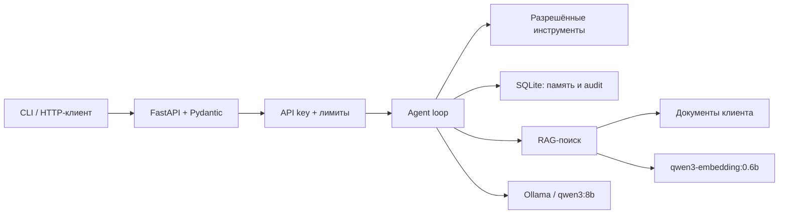

# AI Agent Service Lab

[](https://github.com/aka-gst/ai-agent-service-lab/actions/workflows/tests.yml)
[](LICENSE)

Учебно-практический проект Сергея Каспировича: разобраться, как устроены AI-агенты, научиться собирать их под реальные задачи и превратить этот навык в понятную услугу для клиентов.

## Что уже работает

- локальная генерация через Ollama и `qwen3:8b`;
- structured output с JSON Schema и Pydantic;
- agent loop с allowlist безопасных инструментов;
- память сессий и audit log в SQLite;
- RAG по Markdown-документам с проверяемыми источниками;
- evaluation-набор: 6/6 сценариев, retrieval hit rate 100%;
- FastAPI, API-key guard, Docker Compose и health checks;
- backup/restore с SHA-256 и защита от path traversal;
- 68 автоматических тестов;
- первый модуль помощника аналитика маркетплейса на искусственном CSV.

## Архитектура



## Быстрый запуск

Требования: Python 3.12+, [uv](https://docs.astral.sh/uv/), Ollama и модели `qwen3:8b`, `qwen3-embedding:0.6b`.

```bash
uv sync --python 3.12
uv run python -m agent_lab.rag index
uv run pytest -q
uv run uvicorn agent_lab.service:app --host 127.0.0.1 --port 8000
```

Проверка сервиса:

```bash
curl http://127.0.0.1:8000/health
curl http://127.0.0.1:8000/ready
```

Веб-интерфейс помощника: <http://127.0.0.1:8000/marketplace>.

Вопрос по демонстрационному отчёту маркетплейса:

```bash
curl -X POST http://127.0.0.1:8000/v1/marketplace/ask \
  -H 'Content-Type: application/json' \
  -d '{"question":"Почему процент выкупа маленький?","report":"sales-report.csv"}'
```

Запуск через Docker Desktop:

```bash
docker compose build
docker compose up -d
```

## Конечный результат

После прохождения проекта должны появиться три демонстрационных решения:

1. **Локальный помощник с инструментами** — принимает задачу, выбирает разрешённый инструмент, выполняет действие и сохраняет проверяемый отчёт.
2. **RAG-помощник по документам** — отвечает только на основе загруженных материалов и указывает источники.
3. **Клиентский агент под ключ** — установка, конфигурация, тесты, инструкция, резервное копирование и передача заказчику.

## Что здесь означает «обучить агента»

В большинстве клиентских проектов модель не обучают с нуля. Используются четыре уровня настройки:

1. **Инструкция и примеры** — задаём роль, ограничения и формат ответа.
2. **Инструменты** — разрешаем агенту вызывать API, искать документы или работать с файлами.
3. **RAG** — подключаем собственную базу знаний без изменения весов модели.
4. **Fine-tuning** — дообучаем модель на подготовленном датасете, только если первые три уровня недостаточны.

Обучение модели с нуля в этот проект не входит: оно требует больших датасетов, GPU-кластера и бюджета, а для большинства частных заказов не окупается.

## Технологический маршрут

- Python 3.12+
- HTTP и OpenAI-compatible API
- Ollama для локальных моделей
- Pydantic для схем данных
- pytest для проверок
- FastAPI для локального сервиса
- SQLite и векторное хранилище для памяти/RAG
- Docker — после того, как локальная версия работает
- GitHub Actions для автоматических проверок

## Правила проекта

- Сначала формулируем задачу и критерии качества, затем выбираем модель.
- Секреты хранятся только в локальном `.env`, который не попадает в Git.
- Агент получает минимально необходимые разрешения.
- Каждый важный результат проверяется тестом или сохраняемым evidence.
- Для опасных и внешних действий требуется подтверждение человека.
- Нельзя обещать клиенту «обученную нейросеть», если фактически сделан prompt или RAG.

## Структура

```text
docs/       теория, архитектура и памятки
labs/       последовательные учебные лабораторные работы
projects/   итоговые проекты для портфолио
templates/  анкета клиента, ТЗ, отчёт и инструкция передачи
tests/      автоматические проверки
```

Начинать следует с [ROADMAP.md](ROADMAP.md) и лабораторной работы `labs/01-model-api`.

## Текущий результат

Пройдены лабораторные 1–8: Ollama API, structured output, безопасные инструменты, память SQLite, RAG, evaluation, FastAPI/Docker и передача клиенту. Финальный локальный API упакован в контейнер, а проверяемый набор содержит 41 автоматический тест.

Подробный портфельный разбор: [docs/portfolio-case-study.md](docs/portfolio-case-study.md).

Следующий прикладной проект: [помощник аналитика маркетплейса](labs/09-marketplace-analyst/README.md). Он считает показатели отчёта проверяемым кодом, а затем будет использовать RAG и локальную модель для объяснения результата.

## Лицензия

Исходный код проекта опубликован по лицензии [MIT](LICENSE). Модели, Ollama, Docker и сторонние библиотеки распространяются на собственных условиях и не включены в эту лицензию.
